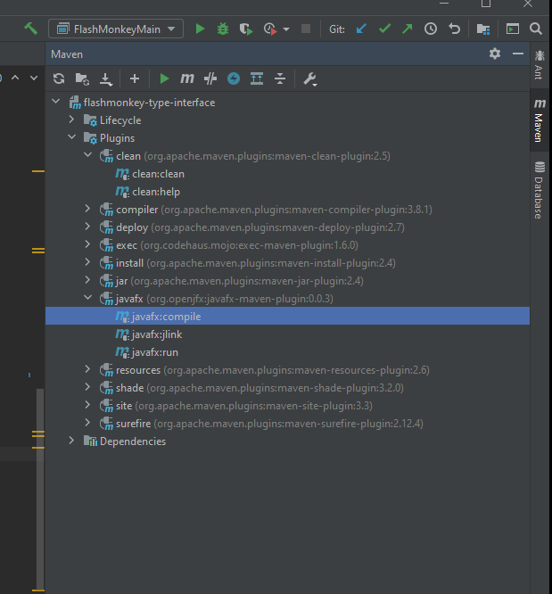
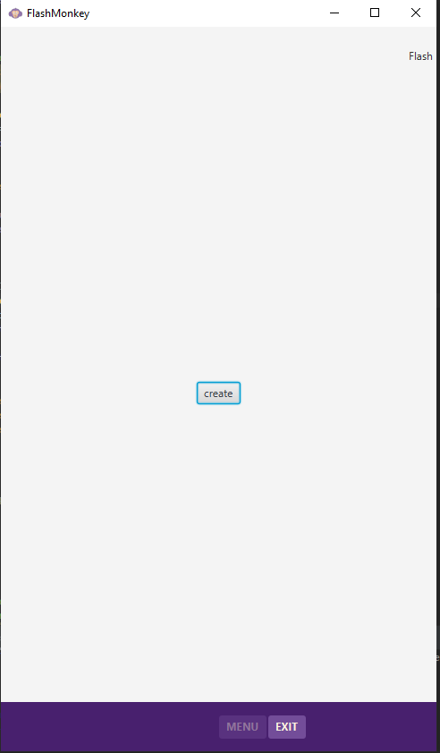

# FlashMonkey developer interface
**FlashMonkey Proprietary**
_Do not disclose outside of FlashMonkey Inc._

This is the repository for the Patent Pending FlashMonkey intelligent study application. FlashMonkey is an interactive 
and multi-media learning application developed by FlashMonkey Inc. 

- Play Nice Rule -
Before contributing or modifying another author's code, please inform them that you are modifying or modified their code. 

<b>Bug Status</b>: Issues. There are no known issues with the SOFTWARE ENGINEERING INTERFACE - type-interface. 
Please document and report any issues to your supervisor. 

<b>OTHER:</b> Updating this document using MarkDown: https://www.markdownguide.org/basic-syntax

<b>GIT and Git Remote tutorial videos:</b>
+ <a href="https://www.youtube.com/watch?v=uR6G2v_WsRA">Intro to Git: Core Topics by David Mahler</a> 
+ <a href="https://www.youtube.com/watch?v=FyAAIHHClqI" >Intro to Git: Branching and Merging by David Mahler</a> 
+ <a href="https://www.youtube.com/watch?v=Gg4bLk8cGNo">Introduction to Git - Remotes by David Mahler</a> 
+ <a href="https://www.jetbrains.com/help/idea/apply-changes-from-one-branch-to-another.html#cherry-pick">IntelliJ when and how to merge</a>

<b>JavaFX references:</b> An excellent aggregation of JavaFX resources
+ https://github.com/mhrimaz/AwesomeJavaFX

 
 

#Set up this project for Maven and JavaFX
Note that setting up a Java Project for JavaFX after Java 11 is more complex than they were with previous Java SDK's. 
JavaFX is no longer included in the SDK. JavaFX is an open-source project by OpenJFX https://www.openjfx.io

Note: As of April 2021 we are using Java LTS 11 and JavaFX 14. Ask what version of JavafX and Java is being used if this
document is out of date. We are not using Modules, the project is "non-modular".  

**Helpful links**
+ Jetbrains blog as of 2021 under the get started with _JavaFX and Maven, non-modular_ 
https://blog.jetbrains.com/idea/2021/01/intellij-idea-and-javafx/
+ OpenJFX docs _Getting Started with JavaFX_ https://openjfx.io/openjfx-docs/
+ Setting up the project for GitHub using IntelliJ. If this is your first time to set up Git and GitHub, start with the 
following  https://www.jetbrains.com/help/idea/enabling-version-control.html Otherwise, if you are already familiar with
setting up Git and only need to set up the project with GitHub use: https://www.jetbrains.com/help/idea/github.html

**Finding JAVA_HOME** 
+ In the CLI. _$ java -version_  should output the current version of java that you are running on your machine. It will
need to be at least Java 11. Note that this is a moving target since there is the LTS and the 6 month updates by the 
java community. This will also confirm you have java installed. The installation of the 

**openJFX docs** 
+ Read through the guide provided by openJFX <a href="https://openjfx.io/openjfx-docs/#maven"> link </a> and see the differences between modular projects and non-modular projects. 
This project is non-modular as of this writing in April 2021. If you receive the error described in the post, then
you will need to provide the arguments for the Run Configuration show below. 

1. Set up a new project as a Maven Project.

2. Connect the project to the FlashMonkey Inc Repo in GitHub using the instructions above. See your supervisor for access,
password and username.

3. Import the project

4. Ensure the project is synchronized with Maven. Note that the local Maven repo is stored on your machine in the _".m2"_
directory. The preceeding "." indicates it is a hidden directory and you will need to ensure you can access and see 
hidden directories on your machine. Usually the _".m2"_ directory is in your user root directory. In my case, on a windows
machine, it is in the _"C://users/me/.m2"_ 

5. If the project is set up correctly.

_Note: If the project does not run, you may need to add the Run Configuration as provided in the recommended 
<a href="https://openjfx.io/openjfx-docs/#IDE-Intellij">link here.</a>_
+ Note: that the archtype should not be needed. The POM is already provided in the Github download. 
+ enter the following run configuration: 
--module-path (windows example) "C:\path\to\your\jdk\jdk-14.0.1" --add-modules javafx.controls,javafx.fxml,javafx.media,javafx.web,javafx.base

6. To clean, compile, and run the project. This can be done with the Maven slideout on the far right side of the IDE.
under -> Plugins -> clean:clean, then -> Plugins -> javafx -> javafx:compile then Plugins -> javafx > javafx:run. 

 
The end result as the project you should see:

 
 

**JavaDocs** To generate JavaDocs using IntelliJ. Goto Tools -> Generate JavaDoc. Recommend generating javadocs to a 
file outside of the project. Else IntelliJ may intelligently decide to stick JavaDocs where it is most convenient. 
Select Private and press "ok". A browser page should be displayed that shows the documents. 

**Video**

_Play the video "GetStarted.mp4" to see where the flashMonkeyFile directory files are. This is a dated video of the project.
It shows the functionality of creating a card, taking snapshots, and drawing on top of them. It also shows where the 
files are saved. The application has changed as well as the file structure. This is a good start. The file is located in
the readme_resources in the project file structure._  

**LEGAL**

**DISCLAIMER OF WARRANTY.**  

COVERED CODE IS PROVIDED UNDER THIS LICENSE ON AN "AS IS" BASIS, WITHOUT WARRANTY OF ANY KIND, EITHER EXPRESS OR IMPLIED, INCLUDING, WITHOUT LIMITATION, WARRANTIES THAT THE COVERED CODE IS FREE OF DEFECTS, MERCHANTABLE, FIT FOR A PARTICULAR PURPOSE OR NON-INFRINGING. THE ENTIRE RISK AS TO THE QUALITY AND PERFORMANCE OF THE COVERED CODE IS WITH YOU. SHOULD ANY COVERED CODE PROVE DEFECTIVE IN ANY RESPECT, YOU (NOT THE INITIAL DEVELOPER OR ANY OTHER CONTRIBUTOR) ASSUME THE COST OF ANY NECESSARY SERVICING, REPAIR OR CORRECTION. THIS DISCLAIMER OF WARRANTY CONSTITUTES AN ESSENTIAL PART OF THIS LICENSE. NO USE OF ANY COVERED CODE IS AUTHORIZED HEREUNDER EXCEPT UNDER THIS DISCLAIMER.

**The FlashMonkey Application Software is Patent Pending**
This patent does not include nor rely on any software covered by GNU GPL nor any other OpenSource licenses. 

**Copyright (c) 2019 - 2021 FlashMonkey Inc. (https://www.flashmonkey.xyz) & Lowell Stadelman**
